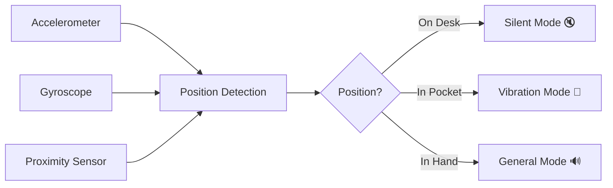

# Welcome to Silent Mate Documentation

Silent Mate is an intelligent Android app that automatically adjusts your phone's audio profile based on how you're holding or placing your device.

## 🎯 Features at a Glance

-   :material-desk:{ .lg .middle } __On Desk Detection__

    ---

    Automatically switches to **Silent Mode** when your phone is lying flat on a surface

    [:octicons-arrow-right-24: Learn more](user-guide/features.md#on-desk-detection)

-   :material-bag-personal:{ .lg .middle } __In Pocket Detection__

    ---

    Switches to **Vibration Mode** when your phone is in your pocket or bag

    [:octicons-arrow-right-24: Learn more](user-guide/features.md#in-pocket-detection)

-   :material-hand-wave:{ .lg .middle } __In Hand Detection__

    ---

    Switches to **General Mode** with full sound when you're using your phone

    [:octicons-arrow-right-24: Learn more](user-guide/features.md#in-hand-detection)

-   :material-battery-heart:{ .lg .middle } __Battery Optimized__

    ---

    Power Saver mode uses only 2-5% battery per day

    [:octicons-arrow-right-24: Performance](user-guide/features.md#performance-modes)

## 🚀 Quick Start

Get up and running in minutes:

1. **[Install](user-guide/getting-started.md#installation)** - Download and install Silent Mate
2. **[Grant Permissions](user-guide/getting-started.md#grant-permissions)** - Allow Do Not Disturb access
3. **[Enable Detection](user-guide/getting-started.md#enable-detection)** - Toggle on sensor switching
4. **Done!** - Your phone now manages audio profiles automatically

[Get Started :material-arrow-right:](user-guide/getting-started.md){ .md-button .md-button--primary }
[View Features :material-arrow-right:](user-guide/features.md){ .md-button }

## 📱 How It Works

Silent Mate uses three hardware sensors to detect your phone's position:

## 🎨 Audio Profiles

| Position | Mode | Sound | Vibration |
|----------|------|-------|-----------|
| 📱 On Desk | Silent | ❌ | ❌ |
| 👖 In Pocket | Vibration | ❌ | ✅ |
| 🤚 In Hand | General | ✅ | ✅ |

## 📚 Documentation Sections

### For Users

- **[Getting Started](user-guide/getting-started.md)** - Installation and setup guide
- **[Features](user-guide/features.md)** - Complete features overview
- **[How to Use](user-guide/how-to-use.md)** - Detailed usage instructions
- **[Troubleshooting](user-guide/troubleshooting.md)** - Common issues and solutions
- **[FAQ](user-guide/faq.md)** - Frequently asked questions

### For Developers

- **[Architecture](technical/architecture.md)** - System design and components
- **[Sensor Logic](technical/sensor-logic.md)** - Detection algorithms
- **[Setup](developer/setup.md)** - Development environment
- **[Contributing](developer/contributing.md)** - How to contribute

## ✨ Why Silent Mate?

!!! success "Privacy First"
    - ✅ No internet connection required
    - ✅ No data collection
    - ✅ All processing on-device
    - ✅ Completely offline

!!! example "Intelligent Automation"
    - ✅ Truly automatic switching
    - ✅ No manual intervention needed
    - ✅ Context-aware detection
    - ✅ Battery efficient

!!! info "Free & Open"
    - ✅ Completely free
    - ✅ No ads
    - ✅ No in-app purchases
    - ✅ Open source (optional)

## 📞 Support

Need help? We've got you covered:

- 📖 **Documentation** - You're reading it!
- 🐛 **Bug Reports** - [GitHub Issues](https://github.com/SenuDyl/SilentMate---A-Context-Aware-Mobile-Application-for-Automated-Sound-Profile-Management/issues)
- 💬 **Discussions** - [GitHub Discussions](https://github.com/SenuDyl/SilentMate---A-Context-Aware-Mobile-Application-for-Automated-Sound-Profile-Management/discussions)
- ✉️ **Email** - support@example.com

## 🔗 Quick Links

- [Download APK](https://github.com/SenuDyl/SilentMate---A-Context-Aware-Mobile-Application-for-Automated-Sound-Profile-Management/releases)
- [View Source Code](https://github.com/SenuDyl/SilentMate---A-Context-Aware-Mobile-Application-for-Automated-Sound-Profile-Management)
- [Report an Issue](https://github.com/SenuDyl/SilentMate---A-Context-Aware-Mobile-Application-for-Automated-Sound-Profile-Management/issues/new)
- [Request a Feature](https://github.com/SenuDyl/SilentMate---A-Context-Aware-Mobile-Application-for-Automated-Sound-Profile-Management/issues/new?labels=enhancement)

---

!!! tip "New to Silent Mate?"
    Start with the [Getting Started Guide](user-guide/getting-started.md) to set up your app in minutes!

!!! question "Having Issues?"
    Check the [Troubleshooting Guide](user-guide/troubleshooting.md) for solutions to common problems.

