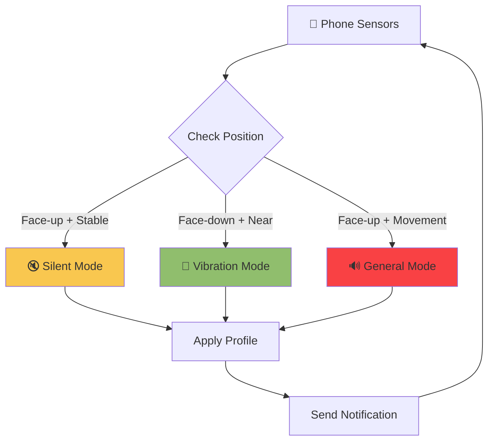
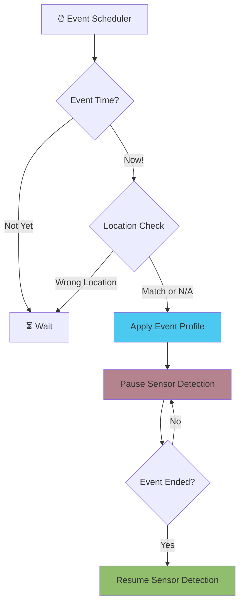
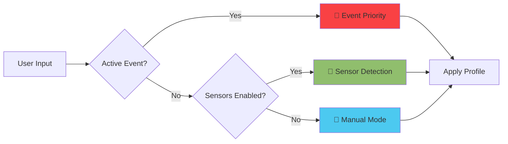

# Welcome to Silent Mate

<div align="center">


**Intelligent Audio Profile Management for Android**

[](https://www.android.com/)
[](about/changelog.md)
[](about/license.md)
[](https://github.com/SenuDyl/SilentMate---A-Context-Aware-Mobile-Application-for-Automated-Sound-Profile-Management/releases)

[Get Started](user-guide/getting-started.md){ .md-button .md-button--primary }
[Download APK](https://github.com/SenuDyl/SilentMate---A-Context-Aware-Mobile-Application-for-Automated-Sound-Profile-Management/releases){ .md-button }
[View on GitHub](https://github.com/SenuDyl/SilentMate---A-Context-Aware-Mobile-Application-for-Automated-Sound-Profile-Management){ .md-button }

</div>

---

## 🎯 What is Silent Mate?

Silent Mate is an intelligent Android application that **automatically manages your phone's audio profile** using two powerful methods:

<div class="grid cards" markdown>

-   :material-radar:{ .lg .middle } **Sensor-Based Detection**

    ---

    Automatically detects your phone's position using hardware sensors and adjusts audio profiles accordingly.

    **→ No manual switching required!**

-   :material-calendar-clock:{ .lg .middle } **Event-Based Scheduling**

    ---

    Schedule audio profiles for specific times and locations. Perfect for meetings, gym, sleep time, and more.

    **→ Set it and forget it!**

</div>

---

## ✨ Key Features

### 📡 Sensor-Based Detection

Automatic position detection using your phone's built-in sensors:

<div class="grid" markdown>

!!! success "📱 On Desk Detection"
    **When:** Phone lying face-up, stable
    
    **Profile:** Silent Mode 🔇
    
    **Sensors:** Accelerometer + Gyroscope
    
    **Perfect for:** Meetings, work, sleep

!!! info "👖 In Pocket Detection"
    **When:** Phone face-down + proximity sensor triggered
    
    **Profile:** Vibration Mode 📳
    
    **Sensors:** Proximity + Accelerometer
    
    **Perfect for:** Walking, commuting, shopping

!!! tip "🤚 In Hand Detection"
    **When:** Phone face-up with movement
    
    **Profile:** General Mode 🔊
    
    **Sensors:** Accelerometer + Gyroscope
    
    **Perfect for:** Browsing, texting, active use

</div>

---

### ⏰ Event-Based Scheduling

Create smart schedules for your audio profiles:

| Feature | Description | Use Case |
|---------|-------------|----------|
| **📅 Time-Based** | Set start and end times | Daily meetings at 9 AM |
| **📍 Location-Based** | Trigger at specific places | Silent at office, vibrate at gym |
| **🔄 Recurring Events** | Daily, Weekly, Monthly | Sleep schedule, weekly classes |
| **🎯 Custom Profiles** | Choose any audio mode | Silent, Vibration, or General |

**Example Events:**

=== "Meeting"

    ```yaml
    Title: Team Standup
    Time: 9:00 AM - 9:30 AM
    Recurrence: Daily (Mon-Fri)
    Location: Office Building
    Profile: Silent 🔇
    ```

=== "Gym"

    ```yaml
    Title: Workout Session
    Time: 6:00 PM - 7:30 PM
    Recurrence: Weekly (Mon, Wed, Fri)
    Location: Fitness Center
    Profile: General 🔊
    ```

=== "Sleep"

    ```yaml
    Title: Sleep Time
    Time: 11:00 PM - 7:00 AM
    Recurrence: Daily
    Location: (None - time only)
    Profile: Silent 🔇
    ```

---

## 🎨 Audio Profiles

Silent Mate manages three audio profiles:

<div class="grid cards" markdown>

-   :material-volume-off:{ .lg .middle } **Silent Mode**

    ---
    
    **Sound:** ❌ Off
    
    **Vibration:** ❌ Off
    
    **Best for:** Meetings, theaters, sleep, focus time
    
    ---
    
    *Alarms still ring at full volume*

-   :material-vibrate:{ .lg .middle } **Vibration Mode**

    ---
    
    **Sound:** ❌ Off
    
    **Vibration:** ✅ On
    
    **Best for:** Pocket, bag, public places, discrete notifications
    
    ---
    
    *Strong vibration patterns for alerts*

-   :material-volume-high:{ .lg .middle } **General Mode**

    ---
    
    **Sound:** ✅ On
    
    **Vibration:** ✅ On
    
    **Best for:** Active use, music, videos, calls
    
    ---
    
    *Full sound and vibration enabled*

</div>

---

## 🚀 Quick Start

Get Silent Mate running in **5 minutes**:

=== "Step 1: Install"

    **Download & Install**
    
    1. Download APK from [GitHub Releases](https://github.com/SenuDyl/SilentMate---A-Context-Aware-Mobile-Application-for-Automated-Sound-Profile-Management/releases)
    2. Enable "Install from Unknown Sources" if prompted
    3. Open APK and tap "Install"
    4. Launch Silent Mate
    
    **Requirements:**
    
    - Android 5.0 (Lollipop) or higher
    - ~10 MB storage
    - ~50 MB RAM during use

=== "Step 2: Permissions"

    **Grant Essential Permissions**
    
    
    
    Required:
    
    - ✅ **Do Not Disturb Access** - Change audio profiles
    - ✅ **Sensor Access** - Position detection (auto-granted)
    
    Optional:
    
    - ⭕ **Location** - Location-based events
    - ⭕ **Notifications** - Status alerts

=== "Step 3: Configure"

    **Choose Your Mode**
    
    
    
    **Option A: Sensor-Based**
    
    1. Go to Sensor screen (center tab)
    2. Toggle ON desired detection modes
    3. Test by moving your phone
    
    **Option B: Event-Based**
    
    1. Tap "+ Add Event" on Home screen
    2. Fill in event details
    3. Save and enable
    
    **Option C: Both!**
    
    Use sensors for automatic switching and events for scheduled overrides.

=== "Step 4: Enjoy"

    **You're All Set! 🎉**
    
    Silent Mate is now managing your audio profiles automatically.
    
    **What happens next:**
    
    - Phone on desk → Silent 🔇
    - Phone in pocket → Vibration 📳
    - Phone in hand → General 🔊
    - Scheduled events → Override sensors
    
    **Need help?** Check the [Troubleshooting Guide](user-guide/troubleshooting.md)

---

## 📊 How It Works

### Sensor-Based Flow



### Event-Based Flow



### Priority System



---

## 🎯 Use Cases

<div class="grid" markdown>

!!! example "Office Worker"
    **Challenge:** Constant audio profile switching during work
    
    **Solution:**
    
    - Create "Work Hours" event (9 AM - 5 PM, Silent)
    - Enable "In Hand" detection for breaks
    - Location-based trigger at office
    
    **Result:** Silent during meetings, sound when picked up

!!! example "Student"
    **Challenge:** Need silence during classes, sound after
    
    **Solution:**
    
    - Schedule classes (Silent mode)
    - Enable sensor detection between classes
    - "In Pocket" mode in hallways (Vibration)
    
    **Result:** Automatic switching between classes and breaks

!!! example "Fitness Enthusiast"
    **Challenge:** Want music at gym, silence elsewhere
    
    **Solution:**
    
    - Create "Gym Time" event (General mode)
    - Location trigger at gym
    - Sensor detection at home/office
    
    **Result:** Music at gym, auto-switching elsewhere

!!! example "Night Owl"
    **Challenge:** Disturbed by notifications during sleep
    
    **Solution:**
    
    - Create "Sleep Schedule" (11 PM - 7 AM, Silent)
    - Daily recurrence
    - No location (works anywhere)
    
    **Result:** Uninterrupted sleep, auto-resume in morning

</div>

---

## 💡 Why Choose Silent Mate?

### Compared to Manual Switching

| Feature | Manual | Silent Mate |
|---------|--------|-------------|
| **Convenience** | Must remember to switch | ✅ Automatic |
| **Accuracy** | Often forget | ✅ Always correct |
| **Context-aware** | No | ✅ Position + Time |
| **Battery Impact** | None | ✅ Minimal (2-10%) |
| **Customization** | Limited | ✅ Fully configurable |

### Compared to Other Apps

| Feature | Silent Mate | Tasker | Do Not Disturb |
|---------|-------------|--------|----------------|
| **Sensor Detection** | ✅ Built-in | ⚠️ Complex setup | ❌ None |
| **Event Scheduling** | ✅ Easy UI | ✅ Advanced | ⚠️ Basic |
| **Location-Based** | ✅ Optional | ✅ Yes | ❌ None |
| **Ease of Use** | ✅ Simple | ❌ Steep learning curve | ✅ Simple |
| **Price** | ✅ Free | 💰 Paid | ✅ Free |
| **Privacy** | ✅ No data collection | ⚠️ Varies | ✅ System app |
| **Battery** | ✅ Optimized | ⚠️ Varies | ✅ Minimal |

---

## 🛡️ Privacy & Security

!!! success "Privacy First"
    **Silent Mate respects your privacy:**
    
    - ✅ **No Internet Required** - Works completely offline
    - ✅ **No Data Collection** - Zero tracking or analytics
    - ✅ **No Ads** - Clean, ad-free experience
    - ✅ **On-Device Processing** - Everything stays on your phone
    - ✅ **Open Source** - Code is transparent and reviewable
    - ✅ **Minimal Permissions** - Only what's necessary

**Permissions Explained:**

| Permission | Purpose | Required? |
|------------|---------|-----------|
| Do Not Disturb | Change audio profiles | ✅ Yes |
| Sensors | Position detection | ✅ Yes (auto-granted) |
| Location | Location-based events | ⭕ Optional |
| Notifications | Status updates | ⭕ Optional |

---

## 📈 Performance

### Battery Usage

| Mode | Battery/Day | Detection Speed | Recommended For |
|------|-------------|-----------------|-----------------|
| **Power Saver** | 2-5% | 500-2000ms | Daily use |
| **High Performance** | 5-10% | 200-1000ms | Active testing |
| **Events Only** | <1% | Instant | Scheduled profiles only |

### Accuracy Metrics

| Detection Type | Accuracy | False Positives |
|----------------|----------|-----------------|
| On Desk | ~95% | <2% |
| In Pocket | ~90% | <5% |
| In Hand | ~95% | <3% |

---

## 📚 Documentation

<div class="grid cards" markdown>

-   :material-rocket-launch:{ .lg .middle } **Getting Started**

    ---

    Complete setup guide with step-by-step instructions
    
    [:octicons-arrow-right-24: Start here](user-guide/getting-started.md)

-   :material-star-four-points:{ .lg .middle } **Features**

    ---

    Detailed overview of all sensor and event-based features
    
    [:octicons-arrow-right-24: Explore features](user-guide/features.md)

-   :material-help-circle:{ .lg .middle } **Troubleshooting**

    ---

    Solutions to common problems and device-specific issues
    
    [:octicons-arrow-right-24: Get help](user-guide/troubleshooting.md)

-   :material-frequently-asked-questions:{ .lg .middle } **FAQ**

    ---

    Answers to frequently asked questions
    
    [:octicons-arrow-right-24: Read FAQ](user-guide/faq.md)

-   :material-code-braces:{ .lg .middle } **Developer Docs**

    ---

    Architecture, APIs, and contribution guidelines
    
    [:octicons-arrow-right-24: For developers](developer/setup.md)

-   :material-book-open-variant:{ .lg .middle } **Technical Docs**

    ---

    Deep dive into sensor logic and audio management
    
    [:octicons-arrow-right-24: Learn more](technical/architecture.md)

</div>

---

## 🤝 Community & Support

### Get Help

- 📖 **Documentation** - You're reading it!
- 🐛 **Bug Reports** - [GitHub Issues](https://github.com/SenuDyl/SilentMate---A-Context-Aware-Mobile-Application-for-Automated-Sound-Profile-Management/issues)
- 💬 **Discussions** - [GitHub Discussions](https://github.com/SenuDyl/SilentMate---A-Context-Aware-Mobile-Application-for-Automated-Sound-Profile-Management/discussions)
- ✉️ **Email** - support@example.com

### Contribute

We welcome contributions!

- 🐛 Report bugs
- 💡 Suggest features
- 📝 Improve documentation
- 💻 Submit pull requests
- ⭐ Star the repository

[Contributing Guide →](developer/contributing.md)

### Stay Updated

- 📢 **Releases** - [GitHub Releases](https://github.com/SenuDyl/SilentMate---A-Context-Aware-Mobile-Application-for-Automated-Sound-Profile-Management/releases)
- 📋 **Changelog** - [Version History](about/changelog.md)
- 🎯 **Roadmap** - [Planned Features](about/changelog.md#roadmap)

---

## 🎓 Learn More

!!! tip "New Users"
    **Just installed Silent Mate?**
    
    1. Read the [Getting Started Guide](user-guide/getting-started.md)
    2. Create your first [scheduled event](user-guide/getting-started.md#creating-events)
    3. Test [sensor detection](user-guide/getting-started.md#test-sensor-based-detection)
    4. Explore [advanced features](user-guide/features.md)

!!! info "Power Users"
    **Want to maximize Silent Mate?**
    
    - Combine sensor and event modes
    - Create location-based profiles
    - Fine-tune detection settings
    - Set up recurring schedules
    
    [Advanced Guide →](user-guide/how-to-use.md)

!!! question "Developers"
    **Want to contribute?**
    
    - Review the [architecture](technical/architecture.md)
    - Understand [sensor logic](technical/sensor-logic.md)
    - Set up [dev environment](developer/setup.md)
    - Read [contribution guidelines](developer/contributing.md)

---

## 📜 License

Silent Mate is licensed under the [MIT License](about/license.md).

**TL;DR:** You can use, modify, and distribute Silent Mate freely, even for commercial purposes.

---

## 🌟 Show Your Support

If you find Silent Mate helpful:

- ⭐ [Star on GitHub](https://github.com/SenuDyl/SilentMate---A-Context-Aware-Mobile-Application-for-Automated-Sound-Profile-Management)
- 🐛 [Report bugs](https://github.com/SenuDyl/SilentMate---A-Context-Aware-Mobile-Application-for-Automated-Sound-Profile-Management/issues)
- 💡 [Suggest features](https://github.com/SenuDyl/SilentMate---A-Context-Aware-Mobile-Application-for-Automated-Sound-Profile-Management/issues/new?labels=enhancement)
- 📢 Share with friends
- 📝 Write a review

---

<div align="center">

**Made with ❤️ for the Android community**

[Get Started Now](user-guide/getting-started.md){ .md-button .md-button--primary }

*Silent Mate - Smart Audio Management, Simplified*

</div>