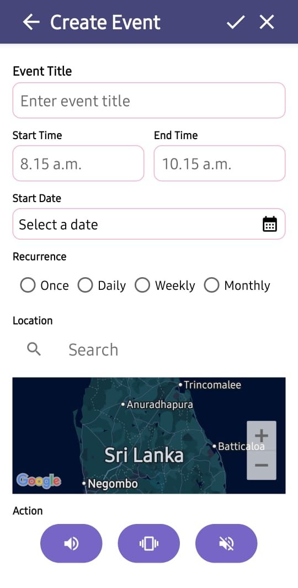

# Getting Started

Welcome to Silent Mate! This comprehensive guide will help you get started with the app and master both sensor-based and event-based audio profile switching.

## Installation

### Requirements

- **Android Version:** 5.0 (Lollipop) or higher
- **Sensors Required:**
  - Accelerometer (all modern phones)
  - Gyroscope (most phones)
  - Proximity sensor (recommended for pocket detection)
- **Storage:** ~10 MB
- **RAM:** ~50 MB during active use

### Download & Install

1. Download the APK from the provided source
2. Enable "Install from Unknown Sources" if prompted
3. Open the APK file and tap "Install"
4. Wait for installation to complete
5. Tap "Open" to launch Silent Mate

---

## Initial Setup


### Step 1: Grant Permissions

When you first launch Silent Mate, you'll need to grant essential permissions. These are managed in the **Settings** screen:


#### Required Permissions

**1. Do Not Disturb Override** 🔇
- **Purpose:** Allows the app to change audio profiles automatically
- **Required:** Yes (core functionality)
- **How to grant:** Settings → Do Not Disturb Override → Toggle ON
- **System prompt:** You'll be redirected to system settings to allow

**2. Location** 📍
- **Purpose:** Enables location-based event triggering
- **Required:** Only for location-based events
- **How to grant:** Settings → Permissions → Location → Toggle ON
- **Privacy:** Used only for event matching, not tracked

**3. Sensor Access** 📡
- **Purpose:** Reads accelerometer, gyroscope, and proximity sensors
- **Required:** Yes (for sensor-based switching)
- **How to grant:** Settings → Permissions → Sensor Access → Toggle ON
- **Automatically granted:** On most Android versions

#### Optional Settings

**Notifications** 🔔
- Toggle ON to receive alerts when audio profiles change
- Shows position detection and profile switches
- Can be customized in system settings


**Notification Types:**
- **Position Changes:** "In Pocket detected - Vibration Mode"
- **Event Triggers:** "Meeting started - Silent Mode activated"
- **Profile Switches:** Real-time updates with emoji indicators

**Performance Mode** ⚡
- **OFF (Power Saver):** 2-5% battery per day, slower detection (500-2000ms)
- **ON (High Performance):** 5-10% battery per day, faster detection (200-1000ms)
- **Recommendation:** Keep OFF for daily use

**Dark Mode** 🌙
- Toggle ON for dark theme throughout the app
- Reduces eye strain and saves battery on OLED screens
- Maintains purple/pink color scheme


### Step 2: Complete Tutorial

On first launch, you'll see a quick tutorial explaining:

- Two switching modes: Sensor-based and Event-based
- Three audio profiles: Silent, Vibration, General
- How to create events and enable sensor detection
- Key features and permissions

You can:
- Swipe through the tutorial screens
- Tap "Skip" to skip the tutorial
- Tap "Get Started" when finished

The tutorial only appears once. You can always refer to this documentation later.

---

## Understanding Silent Mate's Two Modes

Silent Mate offers **two powerful ways** to manage your audio profiles:

### 1. 📡 Sensor-Based Audio Switching

**How it works:**
- Uses phone sensors (accelerometer, gyroscope, proximity)
- Automatically detects phone position
- Switches audio profile based on position

**Three Detection Modes:**

| Position | Sensors Used | Audio Profile |
|----------|-------------|---------------|
| 📱 **On Desk** | Accelerometer + Gyroscope | Silent 🔇 |
| 👖 **In Pocket** | Proximity + Accelerometer | Vibration 📳 |
| 🤚 **In Hand** | Accelerometer + Gyroscope | General 🔊 |

**Enable/Disable:**
- Navigate to Sensor screen (bottom navigation, center icon)
- Toggle individual detection modes
- Real-time sensor data displayed


---

### 2. ⏰ Event-Based Audio Switching

**How it works:**
- Schedule audio profiles for specific times/locations
- Create recurring events (daily, weekly, monthly)
- Automatic profile switching when event starts

**Perfect for:**
- Regular meetings or classes
- Gym sessions  
- Sleep schedule
- Work hours
- Commute times

---

## Creating Events



### Step-by-Step: Create Your First Event

1. **Open Home Screen** and tap **"+ Add Event"** button

2. **Fill in Event Details:**

   **Event Title**
   - Enter a descriptive name (e.g., "Monday Meeting", "Gym Time", "Sleep")
   - Helps you identify the event in your list

   **Start Time**
   - Tap the time field to open time picker
   - Set when the event begins (e.g., 8:15 AM)
   - Format: 12-hour or 24-hour based on system settings

   **End Time**
   - Set when the event ends (e.g., 10:15 AM)
   - Audio profile automatically switches back after end time

   **Start Date**
   - Tap "Select a date" to open calendar
   - Choose the first occurrence date
   - Required for all events

   **Recurrence** *(Choose one)*
   - ⭕ **Once** - Single occurrence only
   - ⭕ **Daily** - Repeats every day
   - ⭕ **Weekly** - Repeats every week (same day)
   - ⭕ **Monthly** - Repeats every month (same date)

   **Location** *(Optional)*
   - Search for a location on the map
   - Event triggers only when you're at this location
   - Uses GPS (requires Location permission)
   - Leave blank for time-only events

   **Action** *(Choose audio profile)*
   
   Three buttons to select profile:
   
   | Button | Icon | Mode | When to Use |
   |--------|------|------|-------------|
   | Left | 🔊 | **General** | Music, videos, active use |
   | Middle | 📳 | **Vibration** | Meetings, public places |
   | Right | 🔇 | **Silent** | Sleep, focus time, theaters |

3. **Save Event**
   - Tap the **✓ (checkmark)** icon in top-right corner
   - Event is added to your event list
   - Enabled by default

4. **Cancel Creation**
   - Tap the **✕ (X)** icon in top-right corner
   - Or tap back arrow (←) to discard changes

### Example Events

**Meeting Event:**
```
Title: Team Standup
Start Time: 9:00 AM
End Time: 9:30 AM
Date: December 9, 2024
Recurrence: Daily
Location: (Office location)
Action: Silent 🔇
```

**Gym Event:**
```
Title: Gym Workout
Start Time: 6:00 PM
End Time: 7:30 PM
Date: December 10, 2024
Recurrence: Weekly
Location: (Gym location)
Action: General 🔊
```

**Sleep Event:**
```
Title: Sleep Time
Start Time: 11:00 PM
End Time: 7:00 AM
Date: December 7, 2024
Recurrence: Daily
Location: (Leave blank)
Action: Silent 🔇
```

---

## Managing Events


### View Your Events

**Home Screen displays:**
- All created events in chronological order
- Event title, time, and audio profile
- Enable/disable toggle for each event
- Upcoming events highlighted

### Edit an Event

1. Tap on the event in the list
2. Make your changes
3. Tap ✓ to save

### Delete an Event

1. Long-press the event
2. Tap "Delete" in the menu
3. Confirm deletion

### Enable/Disable Events

- Toggle switch next to each event
- **Enabled (pink):** Event is active
- **Disabled (gray):** Event is paused but not deleted
- Useful for temporary schedule changes

---

## Audio Profile Switching Modes

### Sensor-Based Switching


**Access:** Bottom navigation → Center icon (📡)

**Individual Mode Toggles:**

1. **On Desk** 📱
   - **When:** Phone lying face-up, stable
   - **Profile:** Silent Mode 🔇
   - **Sensors:** Accelerometer (Z-axis > 7) + Gyroscope (movement < 0.1)
   - **Use case:** During work, meetings, sleep

2. **In Pocket** 👖
   - **When:** Phone face-down + proximity sensor detects nearby object
   - **Profile:** Vibration Mode 📳
   - **Sensors:** Proximity (< 5cm) + Accelerometer (Z between -3 and -12)
   - **Use case:** Walking, phone in bag/pocket

3. **In Hand** 🤚
   - **When:** Phone face-up with movement
   - **Profile:** General Mode 🔊
   - **Sensors:** Accelerometer (Z 5-12) + Gyroscope (movement > 0.05)
   - **Use case:** Browsing, texting, active use

**Debug Information:**
- **Z:** Z-axis acceleration (gravity direction)
- **Prox:** Proximity sensor distance (cm)
- **Move:** Movement magnitude from gyroscope
- **Pos:** Currently detected position

**How to Use:**
1. Toggle ON desired detection modes
2. Place phone in different positions to test
3. Watch real-time sensor values update
4. Position and profile display at top

### Event-Based Switching

**Access:** Home screen → Settings (⚙️)


**Event-based Audio Switching** ⏰
- Toggle ON to enable scheduled events
- Toggle OFF to disable all events (sensor-only mode)
- Located at bottom of Settings screen
- Events still saved when disabled

---

## Priority System

When both modes are enabled:

**Priority Order:**
1. 🥇 **Active Events** (Highest)
   - Scheduled events override sensor detection
   - While event is active, sensors are paused
   
2. 🥈 **Sensor Detection** (Medium)
   - Works when no event is active
   - Continuously monitors phone position

3. 🥉 **Manual Override** (User Control)
   - You can manually change audio mode anytime
   - Will be overridden by next event/sensor change

**Example Scenario:**
```
9:00 AM - Event starts: "Meeting" (Silent Mode)
         → Audio switches to Silent
         → Sensor detection paused

9:30 AM - Event ends
         → Sensor detection resumes
         → If phone in hand: Switches to General
         → If phone on desk: Stays Silent
         → If phone in pocket: Switches to Vibration

10:00 AM - No events active
          → Fully sensor-controlled
          → Changes with phone position
```

---

## Understanding the Interface

### Home Screen 🏠


**Top Section:**
- **Current Status Card:** Shows active position/event and audio profile
- **Sensor Switching Toggle:** Master on/off for sensor-based detection

**Event Section:**
- **Event List:** All created events displayed
- **+ Add Event Button:** Opens event creation dialog
- **Event Toggle Switches:** Enable/disable individual events

**Quick Actions:**
- Toggle sensor switching on/off
- View upcoming events
- Quick access to event management
- Navigate to other screens

### Sensor Screen 📱


**Top Section:**
- **Current Position:** Real-time detected state
- **Current Profile:** Active audio mode

**Detection Toggles:**
- **On Desk** 📱 - Silent mode
- **In Pocket** 👖 - Vibration mode
- **In Hand** 🤚 - General mode

**Debug Panel:**
Live sensor readings updated every 500ms:
- **Z:** Vertical acceleration (face-up/down indicator)
- **Prox:** Proximity distance in centimeters
- **Move:** Gyroscope magnitude (movement detection)
- **Pos:** Current detected position

**What You Can Do:**
- Enable/disable specific detection modes
- Monitor live sensor data
- Test different phone positions
- Troubleshoot detection issues

### Settings Screen ⚙️


**Notifications** 🔔
- Enable/disable status change notifications
- Shows when position or event changes profile
- Customizable in system notification settings

**Permissions Section:**

**Location** 📍
- Required for location-based events
- Optional if you only use time-based events
- Redirects to system settings when toggled

**Do Not Disturb Override** 🔇
- **Required permission** for core functionality
- Allows app to change ringer modes
- Must be enabled for audio switching to work

**Sensor Access** 📡
- Required for sensor-based detection
- Reads accelerometer, gyroscope, proximity
- Usually auto-granted by system

**Performance & Appearance:**

**Performance Mode** ⚡
- **OFF:** Power Saver (recommended)
  - 2-5% battery per day
  - Detection: 500-2000ms
- **ON:** High Performance
  - 5-10% battery per day
  - Detection: 200-1000ms

**Dark Mode** 🌙
- Toggle dark theme
- System-wide application
- OLED battery savings
- Purple/pink theme preserved

**Event-based Audio Switching** ⏰
- Master toggle for all scheduled events
- **ON:** Events active
- **OFF:** Sensor-only mode
- Events remain saved when disabled

**Bottom Navigation:**
- 🏠 **Home** - Events and status
- 📡 **Sensor** - Real-time monitoring
- ⚙️ **Settings** - Configuration

---

## First Use Testing

### Test Sensor-Based Detection

#### Test 1: On Desk (Silent Mode)

1. Go to Sensor screen
2. Enable "On Desk" toggle
3. Place phone face-up on flat surface
4. Keep it still for 2-3 seconds
5. **Expected:** "On Desk 📱 detected - Silent Mode 🔇"
6. **Verify:** Phone is now in Silent mode

**Debug values to look for:**
- Z: ~9-10 (face-up)
- Move: <0.1 (stable)
- Prox: >5cm (no nearby objects)

#### Test 2: In Pocket (Vibration Mode)

1. Enable "In Pocket" toggle
2. Turn phone face-down (screen facing down)
3. Cover top of phone with hand (proximity sensor)
4. Wait 2-3 seconds
5. **Expected:** "In Pocket 👖 detected - Vibration Mode 📳"
6. **Verify:** Phone vibrates instead of ringing

**Debug values to look for:**
- Z: ~-9 to -10 (face-down)
- Prox: <5cm (object detected)
- Move: Any value

#### Test 3: In Hand (General Mode)

1. Enable "In Hand" toggle
2. Pick up phone normally (face-up)
3. Move it slightly or tilt it
4. Wait 1-2 seconds
5. **Expected:** "In Hand 🤚 detected - General Mode 🔊"
6. **Verify:** Phone has full sound enabled

**Debug values to look for:**
- Z: ~5-10 (face-up)
- Move: >0.05 (movement detected)
- Prox: >5cm (no covering)

### Test Event-Based Switching

#### Create a Test Event

1. Go to Home screen
2. Tap "+ Add Event"
3. Create a 5-minute test event:
   ```
   Title: Test Event
   Start: Current time + 1 minute
   End: Current time + 6 minutes
   Recurrence: Once
   Action: Vibration Mode
   ```
4. Save event
5. Wait for start time
6. **Expected:** Notification "Test Event started - Vibration Mode"
7. **Verify:** Audio switched to vibration
8. Wait for end time
9. **Expected:** Event ends, sensor detection resumes

---

## Common First-Time Questions

### Q: Why isn't pocket detection working?

**A:** Check these:
1. ✅ Proximity sensor values change when covered (check Sensor screen)
2. ✅ Phone is face-down (screen facing inward)
3. ✅ "In Pocket" toggle is ON in Sensor screen
4. ✅ No thick case/screen protector blocking sensor
5. ✅ Do Not Disturb permission is granted

### Q: Events not triggering at scheduled time?

**A:** Verify:
1. ✅ Event-based switching is ON in Settings
2. ✅ Event is enabled (toggle is pink)
3. ✅ Phone isn't in battery saver mode (may delay)
4. ✅ App has background permission
5. ✅ Notifications are enabled to see trigger confirmation

### Q: Can I use both sensor and event switching together?

**A:** Yes! They work together:
- Events have priority during scheduled times
- Sensors take over when no event is active
- Both can be enabled simultaneously
- Disable either one in Settings if not needed

### Q: How do I know which mode is controlling my phone?

**A:** Check indicators:
- **Home screen:** Shows "Event Active" or "Sensor Mode"
- **Notifications:** Indicate source ("Event started" vs "Position detected")
- **Sensor screen:** Shows if sensors are active or paused

### Q: Does it work with the screen off?

**A:** Yes! Both modes work when:
- ✅ Screen is off
- ✅ Phone is locked
- ✅ Using other apps
- ✅ Phone is in standby
- ⚠️ May be delayed in aggressive battery saver modes

### Q: How much battery does it use?

**A:** Battery usage depends on settings:
- **Sensor-only (Power Saver):** 2-5% per day
- **Sensor-only (High Performance):** 5-10% per day
- **Events-only:** <1% per day (negligible)
- **Both enabled (Power Saver):** 3-6% per day

### Q: Can I disable certain modes?

**A:** Yes! Full customization:
- **Sensor screen:** Toggle individual detection modes
- **Settings:** Disable sensor-based or event-based entirely
- **Event list:** Disable individual events
- Mix and match based on your needs

---

## Tips for Best Results

### Sensor Detection Tips

1. **On Desk Detection:**
   - Place phone on flat, stable surface
   - Avoid wobbly or vibrating surfaces
   - Face-up orientation works best

2. **Pocket Detection:**
   - Ensure phone is face-down (screen inward)
   - Remove thick cases if detection fails
   - Keep proximity sensor clean and unobstructed

3. **Hand Detection:**
   - Natural holding position works best
   - Even slight movement triggers detection
   - Works while browsing, texting, or gaming

### Event Creation Tips

1. **Use Descriptive Names:**
   - Good: "Monday Team Meeting"
   - Bad: "Event 1"

2. **Set Realistic Times:**
   - Add 5-minute buffer before/after
   - Account for travel time

3. **Choose Appropriate Recurrence:**
   - Regular meetings: Daily or Weekly
   - Monthly appointments: Monthly
   - One-time events: Once

4. **Location-Based Events:**
   - Test location detection accuracy first
   - Set larger radius for better reliability
   - Keep GPS/Location services enabled

---

## Next Steps

Now that you're set up:

1. ✅ **Learn Advanced Features** - Read the [Features](features.md) guide
2. ✅ **Customize Settings** - Explore all configuration options
3. ✅ **Optimize Performance** - See tips in [Troubleshooting](troubleshooting.md)
4. ✅ **Get Help** - Visit [FAQ](faq.md) for common questions

---

## Need Help?

If you encounter issues during setup:

- 📖 **Check [Troubleshooting Guide](troubleshooting.md)** - Solutions to common problems
- ❓ **Review [FAQ](faq.md)** - Frequently asked questions
- 🔧 **Test Sensors** - Use Sensor screen to verify hardware
- ✅ **Verify Permissions** - Ensure all required permissions granted
- 📧 **Contact Support** - See [Support](../about/support.md) for help channels

**Welcome to Silent Mate! 🎯📱**

Enjoy intelligent, automatic audio profile management!